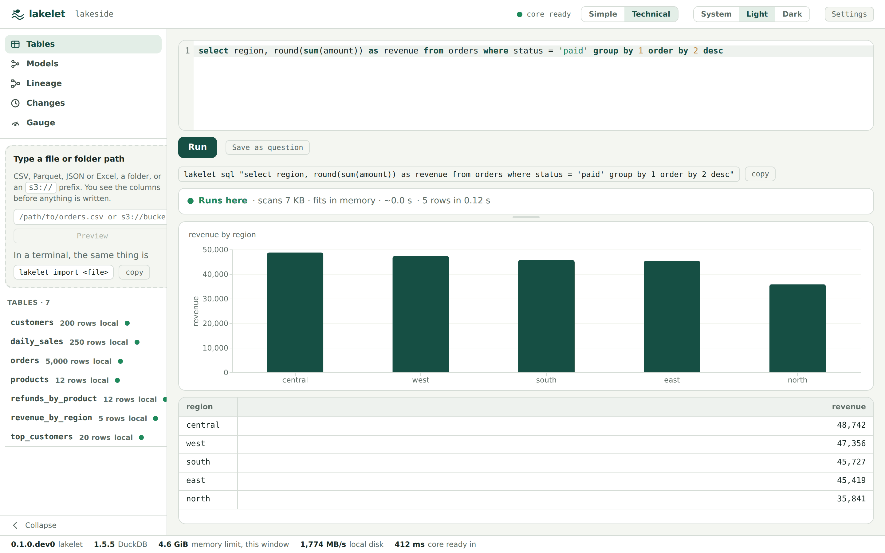

# Lakelet

An open-source, local-first lakehouse in one binary: Iceberg tables on your laptop, DuckDB as the engine, dbt built in, and a gauge that says whether a query fits on this machine before it runs. Everything stays in one folder you can copy, and every table is plain Parquet and Iceberg metadata that Spark, Trino and pyiceberg read too.

Developer preview, macOS and Linux, from source. Apache 2.0. Site and docs: **https://hantswilliams.github.io/lakelet/**



## What it is

You point Lakelet at a folder. `lakelet init` makes it a lakehouse: an Iceberg catalog in SQLite, a `warehouse/` for the tables, a dbt project for the questions you save, and a git repository so every save is a version. You import CSV, Parquet, JSON or Excel and get Iceberg tables; you attach Parquet already in a bucket without copying it; you write SQL and, before a row comes back, the gauge tells you **Runs here**, **Runs here, slowly**, or **Needs more machine** — with the bytes it will scan and the seconds it expects, from the table statistics, not from running it. Red refuses until you say run anyway. A query you want to keep becomes a dbt model with two checks and a version, in one command or one click. The desktop app is the same core with screens; the CLI can do everything the app can.

What it is not, yet: burst to your own cloud when the laptop is not enough, questions in English, and an MCP server for agents are designed and on the site as *planned*. The block below is the honest list, generated from the same file the site reads.

## What is built and what is planned

<!-- status:start -->
*Generated from `web/src/data/status.ts` (as of 2026-09-17); `python3 web/scripts/gen-readme-status.py` rewrites it, CI checks it.*

**Built, from source, today**

- **The CLI**: init, import, sql, estimate, tables, config — from a clone, with uv — [docs](https://hantswilliams.github.io/lakelet/docs/cli)
- **The gauge**: the verdict and its sentence before anything runs; Red refuses, and every run is recorded — [docs](https://hantswilliams.github.io/lakelet/docs/gauge)
- **Files into Iceberg tables**: CSV, TSV, Parquet, JSON, JSONL and Excel, with the type coercions written down — [docs](https://hantswilliams.github.io/lakelet/docs/tables)
- **Parquet already in S3**: attach, refresh and discover a prefix in place — nothing copied, and public buckets need no credentials — [docs](https://hantswilliams.github.io/lakelet/docs/remote)
- **The Iceberg REST catalog**: SQLite locally, served over HTTP; DuckDB, pyiceberg, Spark and Trino all read it — [docs](https://hantswilliams.github.io/lakelet/docs/catalog)
- **Saved questions as dbt models**: each one written with two checks, built through the catalog by dbt — [docs](https://hantswilliams.github.io/lakelet/docs/questions)
- **lakelet run — the dbt DAG, by verdict**: every model gets its own verdict before it builds, dbt runs through the catalog, and view models become Iceberg views every engine can see — [docs](https://hantswilliams.github.io/lakelet/docs/dbt)
- **The local HTTP API**: lakelet serve, loopback only, bearer token, results as an Arrow stream — [docs](https://hantswilliams.github.io/lakelet/docs/api)
- **The desktop app**: from source, no installer: projects, drop-to-import with a preview, the SQL screen with the verdict before the rows, the streaming grid, the auto-chart, the table detail, the Gauge screen with estimate-versus-actual, settings — [docs](https://hantswilliams.github.io/lakelet/docs/app)
- **Proof it stays put**: lakelet audit network measures zero outbound attempts on the quickstart; PRIVACY.md says exactly what is stored where — [docs](https://hantswilliams.github.io/lakelet/docs/install)
- **Every save is a version**: the project is a git repository, a save or a run is a commit, lakelet versions and restore, the Versions section on the model detail — [docs](https://hantswilliams.github.io/lakelet/docs/questions)
- **Lineage, and whether a model is out of date**: lakelet lineage says what a table, view or model reads and what reads it, and how each edge is known; every model carries a state — fresh, edited, upstream, never — with what changed, and lakelet run --stale builds only what is not — [docs](https://hantswilliams.github.io/lakelet/docs/tables#lineage)
- **Backups, crashes, upgrades and moves**: a copy of the folder is the backup, a failed replace keeps the old table, a moved folder is relocated, a newer schema is refused — every sentence tested — [docs](https://hantswilliams.github.io/lakelet/docs/recovery)

**Planned, not built** (the site marks these the same way)

- **The ask box (English → SQL)**: model providers, streaming SQL, one repair pass *(session 7 — deprioritised 2026-09-11)*
- **Burst to a worker**: the control plane, the job token, the cap, results back. Every burst number on this site is arithmetic from the plan, not a measurement *(session 8)*
- **lakelet mcp (the agent tools)**: the MCP server, per-tool permissions, the per-agent daily cap and the audit log *(session 5, after session 8)*
- **The Team catalog**: hosted Postgres, vended credentials, scheduled runs, compaction and alerts *(session 8 onward)*
- **Installers and a brew tap**: signed DMG, the extensions bundled, a PyPI release. Until then: clone and uv sync *(session 10)*
- **Per-machine correction**: the gauge's constants were tuned on one machine; the record is kept, the correction is not applied yet *(session 10)*
- **Self-hosted**: the catalog and control plane in your own VPC, SSO, audit to your SIEM *(after the Team tier)*
<!-- status:end -->

## Install today

Requirements: macOS or Linux, Python 3.12 or newer, and [uv](https://docs.astral.sh/uv/). Windows is untried. Installers, a brew tap and a PyPI release are session 10; until then it is a clone.

```bash
git clone https://github.com/hantswilliams/lakelet.git
cd lakelet/core
uv sync                     # the runtime, dbt, and the test suite's dependencies
uv run lakelet --version
```

`uv tool install --editable .` in `core/` puts `lakelet` on your path; the quickstart below uses `uv run` from `core/` and points at a project folder with `-C`.

## Ten minutes, start to finish

The sample data is a small made-up lakeside shop (about 500 KB, four CSVs); the script writes it, nothing is committed.

```bash
python3 ../examples/sample-data/make_sample.py ~/lakelet-demo/sample   # from core/
mkdir -p ~/lakelet-demo/shop
uv run lakelet init ~/lakelet-demo/shop                                 # the one-time extension download
uv run lakelet -C ~/lakelet-demo/shop import ~/lakelet-demo/sample      # four tables, one per file
uv run lakelet -C ~/lakelet-demo/shop tables list
uv run lakelet -C ~/lakelet-demo/shop sql "select region, sum(total) as revenue from orders group by 1 order by 2 desc"
uv run lakelet -C ~/lakelet-demo/shop question save "Revenue by region" --sql "select region, sum(total) as revenue from orders group by 1"
uv run lakelet -C ~/lakelet-demo/shop run                               # builds it through dbt, with a verdict first
uv run lakelet -C ~/lakelet-demo/shop versions revenue_by_region
uv run lakelet -C ~/lakelet-demo/shop audit network                     # zero outbound attempts, measured
```

The gauge line arrives on stderr before the rows on stdout, so `lakelet sql … > out.csv` works. The [quickstart page](https://hantswilliams.github.io/lakelet/docs/install) has the output each command prints; the [desktop app](https://hantswilliams.github.io/lakelet/docs/app) runs from `app/` with `npm run tauri dev` and opens the same folder.

## Limitations, honestly

- One machine, one writer at a time per table; the catalog serialises commits and retries a conflict three times. Burst is not built.
- Tables are Iceberg format-version 2 and there is no compaction verb yet; a model rebuilt daily accumulates delete files until `lakelet tables expire` and a future `compact` (decided, not built).
- The gauge's constants were tuned on one 18-thread, 64 GB machine; the record of estimate-versus-actual is kept, and a per-machine correction is session 10. Where the gauge cannot attribute a scan (a file read by function, a temp table) it says **Not estimated** rather than guessing.
- No Windows, no installer, no auto-update.
- Everything above is a developer preview: it is used daily by one person on real data and by a test suite against nine sidecars, not yet by strangers.

## Reporting a bug

Open an issue with: `lakelet --version` (Lakelet and DuckDB), the operating system, the command or the screen, and the gauge line if there was one. Never paste data; a made-up file that reproduces it is perfect. Something that looks like a security or privacy problem goes to **[SECURITY.md](SECURITY.md)** instead, privately.

## Privacy and security

Nothing leaves the machine unless you ask for it. **[PRIVACY.md](PRIVACY.md)** says exactly what is stored where, what the one extension download is, how the local server refuses what a browser page could send, and why SQL is code.

## Licence

Apache 2.0 — see [LICENSE](LICENSE) and [NOTICE](NOTICE). Contributions take the DCO sign-off; see [CONTRIBUTING.md](CONTRIBUTING.md).

## Building Lakelet

Coding agents and contributors start at [`CONTRIBUTING.md`](CONTRIBUTING.md), then [`AGENTS.md`](AGENTS.md) (Claude Code reads [`CLAUDE.md`](CLAUDE.md), the same text): the current build brief, the coding rules, and how to run the suites (`cd core && uv run pytest`; `cd app && npm test && npm run e2e`).
