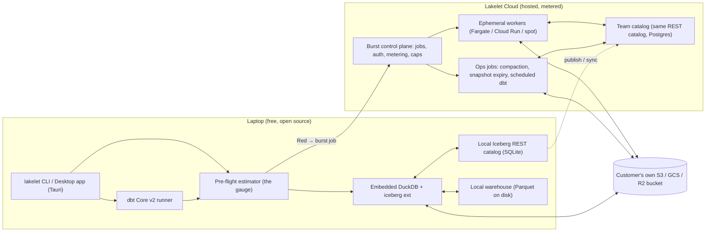

# Lakelet — Architecture & Burst Spec

*Version 0.1 · September 7, 2026 · Amended September 8, 2026 by `build-sessions/core-v0.5-plan.md` §8; where the two differ, the brief wins*

This document turns the thesis ("your laptop is the warehouse until it can't be") into a system design concrete enough to start prototyping. It covers the component model, the storage and catalog decisions, the pre-flight estimator ("the gauge"), the burst execution path, the security model, and a 12-week MVP plan. Open questions that must be validated in the first two weeks are called out explicitly, because several of them are load-bearing.

---

## 1. Design principles

**One binary, local by default.** `lakelet` is a single executable that embeds DuckDB, a local Iceberg REST catalog, the estimator, and the dbt runner. `lakelet init` in an empty directory gives you a working lakehouse with no accounts, no cloud, no daemon.

**Open formats at every layer.** Data is Apache Iceberg on Parquet. The catalog speaks the Iceberg REST spec. Transformations are dbt Core (Apache 2.0). Any engine that speaks Iceberg REST — Spark, Trino, Snowflake, Athena, S3 Tables — can read what Lakelet writes. There is no Lakelet-proprietary format anywhere in the data path, so leaving is as easy as pointing another engine at the bucket.

**The local/cloud boundary is visible and user-controlled.** Nothing runs in the cloud without a number on the screen and a click. The number is a hard cap, not an estimate.

**Own the UX and the catalog, not the engine.** DuckDB is MIT-licensed and governed by the independent DuckDB Foundation (AWS acquired DuckLabs, the company, on Aug 26, 2026 — explicitly not the project). Lakelet's defensibility is in the estimator, the burst orchestration, the catalog service, and the desktop experience. If AWS ships "DuckDB serverless," Lakelet's burst layer can target it as one more worker backend.

---

## 2. System overview



There are three places data can live and two places a catalog can live, and the whole product is about making movement between them explicit:

| | Local | Cloud |
|---|---|---|
| **Data files** | `./warehouse/` (Parquet) | Customer bucket (`s3://…/warehouse/`) |
| **Catalog** | SQLite, embedded in the binary | Postgres, hosted by Lakelet (or BYO Polaris / Lakekeeper / S3 Tables) |
| **Compute** | Embedded DuckDB, bounded by RAM/cores | Ephemeral DuckDB workers, sized per job |

---

## 3. Storage & catalog decisions

### 3.1 Table format: Iceberg (not DuckLake)

DuckDB v1.5.3 (May 29, 2026) made this possible: `MERGE INTO`, `ALTER TABLE`, `bucket()`/`truncate()` partition transforms, and Iceberg V3 (deletion vectors, row lineage) all work from a laptop against REST catalogs. Before that, writing Iceberg meant running Spark, which killed the "one binary" premise.

DuckLake 1.0 (Apr 13, 2026) was seriously considered as the local format: it is exactly the "catalog in a SQL database" pattern Lakelet wants, and it now supports SQLite, Postgres, and DuckDB as catalog backends with multi-writer coordination through Postgres. It loses on one criterion that matters more than everything else: **the burst worker and every third-party engine speak Iceberg REST, not DuckLake.** Using Iceberg end-to-end means the local warehouse and the cloud warehouse are byte-for-byte the same format, and "burst" reduces to pointing a bigger DuckDB at the same prefix. DuckLake's Iceberg-compatible data layer (murmur3 bucketing, Puffin deletion vectors) means a future `lakelet import --from ducklake` is cheap, so we don't close the door.

### 3.2 Catalog: Lakelet ships its own Iceberg REST catalog

DuckDB-Iceberg writes require a REST catalog. The options were to bundle an existing one or write one:

| Option | Verdict |
|---|---|
| Apache Polaris | The open standard, but JVM-based and heavy. Wrong for a laptop binary. Lakelet will be Polaris-*compatible* (it's the same REST spec) and will support BYO Polaris as the team catalog. |
| Lakekeeper | Rust, closest to embeddable, but assumes Postgres. Viable as a hosted option. |
| **Lakelet Catalog (own implementation)** | The Iceberg REST spec surface Lakelet needs — namespaces, tables, load, commit with optimistic concurrency, credential vending — is a few thousand lines. Backing it with SQLite locally and Postgres hosted gives *one codebase for both modes*, which is the Supabase move (Supabase is Postgres plus the tooling around it; Lakelet Catalog is the Iceberg REST spec plus the tooling around it). The server applies commit requirements and updates with pyiceberg's metadata code and writes metadata files with its FileIO; the routing and the state store are Lakelet's (brief D19). |

The catalog is where team collaboration, access control, credential vending, and lineage metadata live. It's the layer Lakelet owns.

**Concurrency.** DuckDB is single-writer *per database file*, but that constraint does not apply here: each DuckDB process (a laptop, a burst worker) writes its own Parquet files and then attempts an atomic metadata commit through the catalog. The catalog enforces optimistic concurrency per table (the standard Iceberg `commit` with `requirements`); conflicting commits are retried by the client. This resolves the "single-writer DuckDB" risk in the original doc without depending on DuckLake's multi-writer work.

### 3.3 Object storage: bring your own bucket

Lakelet never holds customer data at rest. Hosted components (team catalog, control plane) store metadata only. Data files live in the customer's S3, GCS, or R2 bucket. The team catalog vends short-lived, prefix-scoped credentials (STS `AssumeRole` with a session policy on AWS; equivalent on GCS/R2), so laptops and workers never see long-lived keys. This is the Polaris credential-vending pattern and it's the primary "no lock-in" argument against MotherDuck, whose storage is on their cloud in their format.

---

## 4. The gauge: pre-flight estimation

The gauge is the wedge feature, so this is the most detailed section. The goal is not a perfect cost model; it is a **verdict that is right often enough that users trust the click**, and a visible feedback loop that makes it better on their machine.

### 4.1 Inputs

**The plan.** `EXPLAIN (FORMAT JSON)` on the query gives DuckDB's logical plan with per-operator estimated cardinalities. For dbt, Lakelet compiles the project first (`dbt compile`) and runs EXPLAIN on each model's compiled SQL. Predicates for manifest pruning are read from the optimised plan's scan-node filters, not parsed from SQL; the plan's cardinalities are not used for bytes, because they do not reflect file pruning (brief D20).

**Table statistics from Iceberg metadata.** Manifests carry per-data-file row counts, column sizes, null counts, and lower/upper bounds. Lakelet applies the query's partition and column predicates against these bounds to estimate *bytes actually scanned after pruning*, which is the single most predictive input. Reading manifests is cheap (KBs to low MBs) and works identically for local and S3 tables.

**Data locality.** For each table: is it local disk, or a remote bucket? If remote, what is the measured download bandwidth from this laptop (Lakelet runs a 5-second probe at first use and re-measures opportunistically)? This matters more than CPU: scanning 50 GB from S3 over a 200 Mbps home connection takes ~35 minutes; a worker in the bucket's region does it in about a minute. **Most "Red" verdicts in practice will be bandwidth verdicts, not memory verdicts.**

**Machine profile.** Physical RAM, DuckDB's `memory_limit` (default 80% of RAM), core count, free disk for spill, and whether the machine is on battery.

**History.** Every execution records `(fingerprint, estimate, actual)` in a local SQLite table. Lakelet fits a per-machine correction factor per operator class. This is how the gauge gets better without anyone tuning it.

### 4.2 Model

The estimator produces three numbers and a verdict.

*Bytes scanned* = Σ over tables of (data-file bytes surviving partition/bound pruning) × (projected column fraction, from column sizes in manifests).

*Peak memory* = max over the plan of operator memory requirements: hash join build side (estimated rows × row width of the build input), hash aggregate (estimated distinct groups × width), sort/window (input size, unless it can stream), plus a fixed buffer-pool allowance. DuckDB spills to disk rather than failing, so exceeding `memory_limit` is a *performance* cliff, not a crash — which is exactly the Yellow band.

*Wall time (local)* = max(IO time, CPU time), where IO time = bytes scanned ÷ effective throughput (local NVMe ≈ measured; remote ≈ measured bandwidth) and CPU time = Σ(operator cost per row × rows) ÷ effective cores, both multiplied by the learned correction factors. Spill adds a penalty proportional to (peak memory − limit).

*Wall time (burst)* and *burst cost* are computed the same way for a candidate worker size chosen from the peak-memory estimate (see §5.3), plus a fixed cold-start allowance. Until the control plane exists (session 8), both are arithmetic over the worker ladder with a 45 s cold-start allowance and an assumed 200 MB/s read rate, labelled as estimates (brief D29).

### 4.3 Verdict thresholds (initial, tunable)

| Verdict | Condition | UI |
|---|---|---|
| **Green** | peak memory < 60% of `memory_limit` **and** local wall time < 60 s | Runs immediately, gauge shown inline |
| **Yellow** | Spill expected **or** local wall time between 60 s and 10 min | Runs locally by default; burst offered with cost + time comparison |
| **Red** | local wall time > 10 min, **or** remote scan > (bandwidth × 10 min), **or** peak memory > free RAM + free disk | Blocked by default; one-click burst with hard cap shown |

Every verdict shows its reasoning in one line: *"Red: scans 48 GB from s3://…, ~34 min at your 190 Mbps. Burst: ~1.5 min, ≤ $0.41."* That sentence is the product. The words printed are the site's: Green is "Runs here", Yellow "Runs here, slowly", Red "Needs more machine"; the colour names remain the enum (brief D28).

### 4.4 The gauge for dbt runs

`lakelet run` compiles the project, estimates each model, and presents the DAG colored by verdict with totals for the critical path. The user can run the whole DAG locally, burst everything, or let Lakelet split it: Red models run on workers, Green models run locally, and dependencies are respected because every model reads and writes the same Iceberg tables through the same catalog. A split run requires the tables to be reachable from the cloud (§5.2).

### 4.5 Accuracy target and how it's measured

The first spike (§8) runs TPC-H at SF10 and SF100 on a MacBook Pro and against S3, and compares estimates to actuals. The target for MVP is that **80% of queries land within 2× of the estimate for time and within 1.5× for bytes scanned**, and that **no query the gauge called Green takes longer than 3 minutes.** Under-estimating Green is the failure mode that destroys trust; over-estimating Red merely costs a few cents.

---

## 5. Burst execution

### 5.1 Lifecycle

```mermaid
sequenceDiagram
    participant U as lakelet CLI
    participant CP as Control plane
    participant Cat as Catalog (team or synced)
    participant W as Worker
    participant S3 as Customer bucket

    U->>U: gauge → Red, show est. time + cost cap
    U->>CP: POST /jobs {sql|dbt selector, cap, region, tables}
    CP->>Cat: lease tables for job (optional, for local-catalog users)
    CP->>W: launch sized worker (Fargate task / Cloud Run job)
    W->>Cat: load table metadata (short-lived job token)
    Cat-->>W: metadata + vended, prefix-scoped storage credentials
    W->>S3: read Parquet, execute in DuckDB with memory_limit/threads set
    W->>S3: write result Parquet (or new table data files)
    W->>Cat: atomic Iceberg commit (optimistic; retry on conflict)
    W->>CP: metrics: bytes, vCPU-s, GB-s, wall time
    CP-->>U: job complete, actual cost, result location
    U->>S3: lazily read result Parquet into local DuckDB
```

A worker is a container with DuckDB, the iceberg and httpfs extensions, and a ~200-line agent. It receives a job spec, runs it, reports metrics, and exits. Nothing is left running between jobs.

### 5.2 Where the catalog lives during a burst

There are two cases and the CLI is honest about which one you're in.

**Team catalog (hosted).** Laptop and worker both talk to the same catalog. The burst is stateless from the catalog's point of view. This is the default for paying users and the path of least complexity.

**Local catalog only (free solo users).** The worker cannot reach a SQLite file on a laptop. Lakelet handles this with a *catalog lease*: on job submission, the CLI pushes the metadata tree for the involved tables (table metadata JSON, manifest lists and manifests when the table's metadata lives on the laptop, which is the default for registered remote tables; kilobytes, not data; brief D26) to the control plane, which serves it to the worker over the same REST interface. The worker commits back to the control plane; on completion the CLI replays the commit into the local catalog. For the duration of the lease the local catalog refuses writes to those tables. The data itself must already be in a bucket — if a table is local-only, the gauge says so: *"orders is local-only (12 GB). Publishing to s3://… takes ~9 min at your upload speed. Publish and burst?"*

### 5.3 Worker sizing and backends

Sizing is driven by the gauge's peak-memory estimate with a 1.5× safety margin, snapped to the backend's size ladder. Initial backend is AWS Fargate (0.25 vCPU / 0.5 GB up to 16 vCPU / 120 GB), launched in the region of the customer's bucket to avoid egress. Cloud Run Jobs on GCP and Fly Machines (for R2 users) follow, which is the multi-cloud hedge against AWS folding DuckDB into its own services.

Cold start is the known weakness: Fargate tasks take ~30–60 s to start. For jobs the gauge estimates under ~2 minutes, that overhead dominates, so two mitigations are planned: AWS Lambda as a backend for jobs under 10 GB memory and 15 minutes (sub-second start, higher unit price), and, for the paid tier, a small warm pool that trades a little idle cost for sub-5-second starts. The warm pool is an explicit exception to "nothing idle" and is priced into the seat, not the burst.

### 5.4 Cost, the cap, and metering

Cost per job = (vCPU-seconds × vCPU rate + GB-seconds × memory rate) × Lakelet margin + S3 request charges (passed through). At Fargate on-demand list prices (~$0.04/vCPU-hr, ~$0.0044/GB-hr), a 16 vCPU / 64 GB worker costs about $0.93 per hour of run time before margin; most burst jobs will run for minutes, so the typical job is cents to low dollars. Spot capacity reduces this further for jobs that tolerate retry.

The **hard cap** shown before the click is `estimated cost × 2`, rounded up to a clean number. The worker enforces it: the control plane converts the cap to a wall-clock budget for the chosen size, and the agent kills DuckDB when the budget is reached, returning a partial-progress error rather than a surprise invoice. The user can raise the cap deliberately. The commercial promise is simple to state: **the bill for a burst can never exceed the number you clicked.**

Metering records per job: bytes scanned, bytes written, vCPU-s, GB-s, wall time, backend, region, estimate vs actual. The estimate-vs-actual pairs also flow back into the gauge's calibration.

### 5.5 Results

A `SELECT` that produces under ~50 MB streams back inline (Arrow IPC over HTTPS). Larger results are written as Parquet to `s3://<bucket>/_lakelet/results/<job_id>/` and registered as a temporary table in the local DuckDB session, so the user can keep querying the result locally without pulling it all down. `CREATE TABLE AS`, `INSERT`, `MERGE`, and dbt models write directly to their target Iceberg tables through the catalog; nothing comes back but the commit.

---

## 6. Security model

Burst workers receive a single-use job token (JWT, TTL = job timeout) that authorizes exactly one job's table set. Storage access is via credentials vended by the catalog, scoped to the table prefixes involved and expiring with the job. Workers run one job each in a fresh container with no inbound network; the only outbound destinations are the catalog, the control plane, and the customer's bucket. Lakelet's hosted services store catalog metadata, job specs, and metrics; they never store customer data files. SQL text is retained only for the duration of the job unless the user opts into query history sync. Customers who require it can run the control plane and catalog in their own account (the "Ops-in-a-box, self-hosted" tier, later).

---

## 7. Interfaces

### 7.1 CLI (v0 surface)

```
lakelet init [dir]                    # local catalog + warehouse + lakelet.toml
lakelet sql "<query>" | lakelet sql -f file.sql
lakelet estimate "<query>"            # gauge only, no execution
lakelet run [dbt selectors] [--burst auto|never|all]
lakelet publish <table> --to s3://bucket/prefix   # copy data files, register in team catalog
lakelet catalog serve [--port 8181]   # expose the local catalog to other engines
lakelet catalog attach <rest-url>     # use an external Polaris / S3 Tables / Lakekeeper catalog
lakelet login | lakelet burst status | lakelet burst cancel <job> | lakelet cost [--month]
```

`lakelet sql` prints the gauge line, then runs (Green/Yellow) or prompts (Red). `--burst auto` accepts Red verdicts under a per-project cap set in `lakelet.toml` without prompting; this is what scheduled runs use.

### 7.2 Desktop app

Tauri shell (Rust backend, web frontend) over the same core library as the CLI: catalog browser, SQL editor with the gauge rendered inline as you type (estimates are cheap enough to compute on each keystroke pause), dbt DAG view colored by verdict, lineage from Iceberg commit history, and a cost page. The app ships after the CLI has proven the gauge.

### 7.3 Configuration

```toml
# lakelet.toml
[project]
name = "acme-analytics"
warehouse = "./warehouse"            # or s3://acme-data/warehouse

[catalog]
mode = "local"                        # local | team | external
# url = "https://catalog.lakelet.dev/acme"

[burst]
default = "prompt"                    # prompt | auto | never
max_cost_per_run_usd = 5.00
backend = "aws"                       # aws | gcp | fly
region = "us-east-1"
```

---

## 8. Implementation language & MVP plan

**Language.** The core is Python (duckdb, pyiceberg, SQLAlchemy, FastAPI) packaged as a sidecar; Rust only in the Tauri shell, per the v0 build spec and the brief (D2). The catalog store and the gauge model sit behind small interfaces so a later Rust port replaces a module, not the design. Spikes 1 and 2 are real code, the catalog's integration test and the gauge's benchmark harness (brief D13); only spike 3 is throwaway.

**Week 1–2: spikes that de-risk the load-bearing assumptions.**

1. *Local Iceberg writes.* Stand up a minimal Iceberg REST catalog on SQLite and confirm DuckDB v1.5.3 can `CREATE TABLE`, `INSERT`, `MERGE INTO` against a `file://` warehouse and an `s3://` warehouse through it. If DuckDB-Iceberg refuses `file://` warehouses, the fallback is a local S3-compatible shim — find out now.
2. *Estimator accuracy.* TPC-H SF10 and SF100 on a MacBook Pro, local and from S3. Build the manifest-pruning + EXPLAIN model, record estimate vs actual, and check the 2× / 1.5× targets in §4.5.
3. *Worker economics.* One Fargate task running DuckDB against a 10 GB and a 100 GB Iceberg scan in S3: cold start time, wall time, actual cost. This is the number on the landing page.

**Week 3–6: CLI v0 to design partners.** `init / sql / estimate`, local catalog, the gauge; history recorded from run one, calibration in session 10. The landing page and waitlist open; the repo goes public in Day 1 (brief D12).

**Week 7–10: Burst v0.** Control plane (single service, Postgres), Fargate backend in us-east-1, `publish`, catalog lease, hard cap enforcement, metering. Ten design partners running real workloads.

**Week 11–12: dbt + team catalog alpha.** `lakelet run` with DAG-level verdicts and split execution; hosted catalog on Postgres with credential vending; billing on.

---

## 9. Risks and open questions

*DuckDB-Iceberg write maturity.* The write path is three months old. Expect edge cases in schema evolution and V3 features. Mitigation: pin versions, keep an integration test suite against every DuckDB release, and keep the catalog implementation strictly to the REST spec so an engine bug is never a Lakelet data-format bug.

*Estimator trust.* If the gauge cries wolf, users ignore it; if it under-calls Green, they stop trusting the click. The asymmetric thresholds in §4.3 and the history-based correction are the mitigation, but this is the thing to watch in design-partner sessions.

*AWS.* The obvious move is a managed "DuckDB serverless" that would compete with the burst layer. Lakelet's answers: multi-cloud backends, a catalog and UX AWS is unlikely to build for non-AWS storage, and the fact that DuckDB itself remains MIT under the Foundation. If AWS ships it, Lakelet makes it a backend.

*MotherDuck.* $133M raised, $400M valuation at the 2023 Series B, and they removed the $25 tier in early 2026 (free tier is now 3 users / 10 GB / 10 compute-hours; Business is $250/month plus usage). Their hybrid execution decides for you and runs on their storage. Lakelet competes on your bucket, open catalog, visible boundary, and a free tier that stays useful for solo users.

*Cold start.* Addressed in §5.3; the honest version is that sub-2-minute jobs are not a great burst use case until the Lambda backend exists.

*Catalog lease complexity.* The local-catalog burst path (§5.2) is the most intricate piece of the design. If it proves fragile, the fallback is to require a (free) hosted catalog for any burst, which is simpler and also a better funnel into the team tier.

---

## Sources checked for this document

DuckDB, "New DuckDB-Iceberg Features in v1.5.3" (May 29, 2026); About Amazon, "AWS to acquire DuckLabs" (Aug 26, 2026); Apache Polaris, "Graduates to Top Level Project" (Feb 19, 2026); DuckLake, "DuckLake v1.0" (Apr 13, 2026); dbt Developer Blog, "dbt Core v2 is here" (June 2026); Layerbase, "MotherDuck pricing 2026"; Sacra, MotherDuck funding profile; Definite, "Understanding Snowflake pricing" (small-team cost examples).
